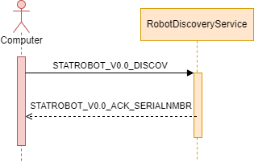

# StatisticalRobot-Server

The server application running on the robots raspberry pi for discovering and configuring the robot within your local network. The server application allows the student to discover the robot, connect with the robot, configure WiFi connections and provides access to the power options of the raspberry pi.

The StatisticalRobot-Server exists of two parts: Mainly an ASP.NET REST API and secondly a UDP Server for local discovery. The StatisticalRobot-Server is also responsible for starting the backup-wifi hotspot when no active WiFi connection is available after booting the robot.

## REST API

The REST API is used to configure the raspberry pi's WiFi connections and to access the power options. For the network configuration, the application uses the nmcli commandline tool installed on the raspberry pi (See [NetworkManager](NetworkManager.cs)). For the power options, the application uses the power commandline tools (See [PowerManager](PowerManager.cs)). The webserver is hosted on port 5000.

### API Endpoints

#### GET `/test/ping`

Request to test the connection with the pi. Always responding with `pong!`

#### GET `/wifi/ap_list`

Gets a list of all available WiFi Access Points within the Raspberry Pi's range.

Expected response body:

```json
[
    {
        "SSID": "string",
        "InUse": true,
        "SignalQuality": 100,
        "SecurityProtocol": "null|Open|string"
    },
    /* More Items */
]
```

#### POST `/wifi/new_connection`

Adds a new wifi connection and immediately connects to it. If any of the required request body fields are in the wrong format, this endpoint returns a `400 Bad Request` response.

Request body:

```json
{
    "SSID": "The SSID of the network",
    "Password": "plain-text string, minimal length of 8. May be null or empty if no password is required for the specified SSID."
}
```

#### GET `/wifi/saved`

Gets a list of all saved WiFi networks on the pi.

Expected response body:

```json
[
    {
        "SSID": "string",
        "Uuid": "string, UUID-format",
        "IsActive": true,
        "AutoConnect": true
    }
]
```

#### POST `/wifi/change_active`

Changes the active network connection and tries to connect the pi to the specified WiFi network.

Request body:

```json
{
    "WifiUuid": "string, UUID-format, the UUID (returned by /wifi/saved) of the wifi network"
}
```

#### DELETE `/wifi/remove_connection`

Deletes the saved wifi connection. If the deleted network connection is the active connection, the pi will disconnect from this network.

GET Parameters:

- `WifiUuid`: The Uuid of the WiFi network to delete

#### POST `/power/shutdown`

Shutsdown the raspberry pi in a safely manner. No request body or GET parameters are needed.

#### POST `/power/reboot`

Reboots the raspberry pi in a safely manner. No request body or GET parameters are needed.

## Robot Discovery Service

The StatisticalRobot-Server provides a simple UDP discovery service for other computers to find and identify their robot on the network. See [RobotDiscoveryService](RobotDiscoveryService.cs).

The discovery service listens for broadcasts on port 9999. All messages are strings encoded in ASCII format. The discovery listens for a UDP Datagram with the content `STATROBOT_V0.0_DISCOV`. If the service recognizes this request, it will respond directly to the sender with the following datagram: `STATROBOT_V0.0_ACK_{RASPI_SERIALNUMBER}`. By including the pi's unique serial number in the response, the searching computer can recognize multiple pi's in the network and is able to re-identify the same pi if its ip-address or its network changes. Because UDP embeds the senders and the receivers ip-address in the UDP-headers, the searching computer receives the pi's ip-address when the discovery service responds to its discover requests.



## Backup Hotspot

The StatisticalRobot-Server is also responsible for launching the backup hotspot. At start-up, a task is ran which checks if the pi has already connected to a Wifi network. If it hasn't, the task will wait for some amount of time for the pi to scan availible networks and connect in the meantime. If this timeout expires and the pi still hasn't connected, the StatisticalRobot-Server commands the pi to host the backup hotspot.

The backup hotspot has the following configuration:

- **WiFi SSID**: `Robot_{RASPI_SHORT_SERIALNUMBER}`, the serialnumber is used for uniqueness of the name and for identification.
- **WiFi Password**: `avansict42`, the password is not meant to be secure, only to temporarly protect the robot from random other people/students taking control of the robot.

## Updating StatisticalRobot-Server in StatisticalRobot-Image

Updating StatisticalRobot-Server in the image is as simple as pushing the latest changes to the master branch and regenerating the image. The image build script automatically pulls the latest version of StatisticalRobot-Server to install within the image.

To develop the StatisticalRobot-Server on the raspberry pi, it's recommended to use the `-dev` image generated by the image script. The dev-image provides persistant storage, swap memory (more memory space) and better logging. Using the `-dev` image also makes sure you're not running the StatisticalRobot-Server twice (as it's not included in the `-dev` image).
