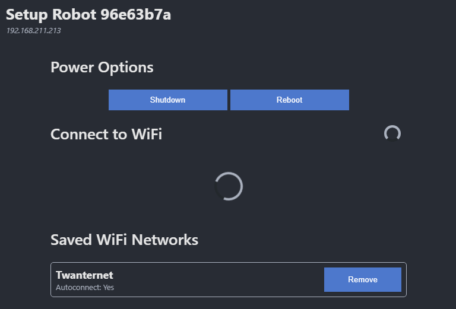

# StatisticalRobot-VSCode-Extension

The VSCode Extension enables the students to discover, configure, build, deploy and debug on their robot. The extension implements the discovery protocol and provides a user-friendly web interface to configure the robot. Using the installed dotnet version, the extension builds their project with the correct build configuration. The build application is than automatically uploaded to their connected pi using SSH.

The VSCode extension is developed using typescript. Modifying the extension requires knowledge about using node.js, javascript and typescript. Also, some experience with developing vscode extensions is recommended or look at the references.

## Requirements

- NodeJS (v20.13.1 or later)
- SSH
- Run `npm install` once in the workspace folder to download all dependencies into the `node_modules` folder

## References

- [VSCode Extension Development Guide](https://code.visualstudio.com/api/extension-guides/overview)
- [VSCode UX Guidelines](https://code.visualstudio.com/api/ux-guidelines/overview)
- [NodeJS SSH2](https://www.npmjs.com/package/ssh2)
- [NodeJS Tar-Stream](https://www.npmjs.com/package/tar-stream)

## Components

The VSCode extension exists of 3 main components:

- **The Robot List (VSCode Tree View)**

  A list in the sidebar showing all discovered robots in the network. Shows buttons to connect to and configure the robot.

- **The Robot Configuration View (VSCode Webview)**
  
  A HTML-page, shown within VSCode, with all WiFi and power configuration options.

- **The Build and Deploy to Robot Task (VSCode Task Provider)**

  Provides the 'statisticalrobot' task-type for building and deploying the C# project to the robot.

### The Robot List

The robot list is a Tree View in the sidebar of VSCode. It utilizes the [RobotDiscoveryService](./src/lib/RobotDiscovery.ts) to discover robots in the network. The code for the robot list can be found in [RobotListProvider.ts](./src/RobotListProvider.ts).


### The Robot Configuration View

The robot configuration view is a HTML webpage for interfacing with the StatisticalRobot-Server REST API. It shows the connection info of the raspberry pi, the power options and the wifi settings.



The webview is programmed using html/css/js in a single file [robotsettings.html](./webviews/robotsettings.html). To modify the design of the webview, the design.html file can be used. This is a copy of the setttings view that doesn't require to connect to a robot.

The robot settings view retrieves the robots information by listening to the `message`-event on the window, which is provided by the VSCode-API. On retrieving this information, the webview tries to connect to the pi by calling the test-endpoint. If the connection succeeds, all other options will be unlocked and the wifi list will be retrieved.

VSCode provides the `Developer: Open Webview Developer Tools` command, which opens a chrome-like developer tools window to view the webviews code and console-output. This eases the debugging and styling process of the webpage.

All Api-calls have been wrapped by a clearly named function, which utilize the custom `request()` function to send requests to the robot.

The settings webview provides a couple of helper functions:

- `request(endpoint, method, body)`: Sends a request to the robots StatisticalRobot-Server to the specified enpoint, with the specified HTTP-Method and optionally a request body.
- `showPageLoading(show, message)`: Shows or hides a full-screen loading animation with optionally a message.
- `showError(message, showRetry)`: Shows a full-screen error message to the user. If showRetry is set to true, a retry button is shown to reset the robot connection and close the error message.
- `enterWifiPassword(wifiAp)`: Shows a password input dialog for entering a password for the specified wifi access point
- `showConfirm(message)`: Shows a confirm (yes/no) dialog
- `elem(tagName, ...classList)`: Creates a new HTMLElement of the specified tag-type and adds all classes in the classList provided to the element.
- `$(selector, first)`: Gets the element for the specified css-selector. If first is set to true, only the first found element is returned.

### The Build and Deploy to Robot Task

This task is responsible for building and uploading the C# robot project to the raspberry pi. The task uses the installed installed dotnet version on the computer (must be in PATH) to build the project for the linux-arm64 architecture. It than connects to the robot over ssh to kill all running instances of the project, removes all old files and recreates the project directory. It than reads all build files from the users computer, puts it in a tar-archive in computer memory (not as a file) and extracts it on the raspberry pi.

To view the full implementation of the build task, see [StatisticalRobotTaskProvider.ts](./src/StatisticalRobotTaskProvider.ts). A SSH-Helper class has been introduced in `./src/lib/SshHelper.ts` for managing the connection and providing an abstraction over the ssh2 library.

To improve performance, the [SshPool](./src/lib/SshPool.ts) class has been introduced. This class manages all open ssh-connections and keeps them open after running the build task. On the next build task, the task tries to reuse the ssh-connection in the SshPool, which saves the time needed to initiate a new ssh-connection (which takes a second or two). If the Ssh connection somehow is dropped, it automatically gets removed from the pool. The ssh connection is quite resilient, it manages to restore the connection, even after multiple seconds of complete loss of WiFi.

## Building the extension package

The extension can be build using the `package` npm script. This script transpiles the typescript code and bundles all code and dependencies to a single file in the `./dist` folder. The VSCE tool (installed automatically in de `node_modules` folder) is ran afterwards to package all code and resources into an installable `.vsix` file in the current working directory. Make sure that all dependencies are retrieved (the `node_modules` directory must exist) by running `npm install` the first time you open this project.

When using VSCode, the `npm: package` task is already provided.

To install the extension, open the extensions view in VSCode, select the three dots and choose "Install from VSIX".


## Dependencies

This extension makes use of the following libraries:

- [NodeJS SSH2](https://www.npmjs.com/package/ssh2)

  Used to establish a ssh connection for running commands on the raspberry pi and uploading the build project files to the raspberry pi.

- [NodeJS Tar-Stream](https://www.npmjs.com/package/tar-stream)

  Used to bundle all files to upload into a single package, which speeds up the upload process.

> **Warning** The SSH2 library advertises to fully run using javascript (which is cross-platform), but is has some optional dependencies generating native code as `.node` files. A special trick was used (see `esbuild.js`) to make bundling with these native files work and the `.vscodeignore` file makes sure these native binaries are not included into the extension. Because the `.node` files are optional for ssh2, this shouldn't cause any problems. IF for some reason in the future, this causes a problem (like cpu-features not found or the connection could not be established because of missing cryptography), another solution must be found to include these native bindings but also keeping the extension cross-platform.

## Available Commands

- `avans-statisticalrobot.discoverRobots`

  (Internal) Instructs the robot discovery service to immediately send a discover-broadcast message and discover all robots on the network.

- `avans-statisticalrobot.refreshAllRobots`
  
  (Internal) Forgets all discovered robots and immediately starts rediscovering robots.

- `avans-statisticalrobot.changeRobotSettings`
  
  (Internal) Opens the robot settings webview for the specified robot.

- `avans-statisticalrobot.openDesignWebview`

  (Visible as `Statistical Robot: Open Design`) Opens the design.html webview

- `avans-statisticalrobot.connectToRobot`

  (Internal) Sets the specified robot as the connected robot by modifying the workspace `.vscode/settings.json`.

- `avans-statisticalrobot.connectedRobotIpAddress`
  
  (Internal) Returns the ip-address of the connected robot, or shows an error message in the right corner of the screen if no robot is connected or the robot is not found on the network.

- `avans-statisticalrobot.fallbackChangeLocalRobotSettings`
  
  (Visible as `Statistical Robot: Change Robot Settings over IP`) Manual option to open a robots settings webview. If for some reason the discovery service isn't able to find the robot on the network, this command enables the user to manually specify a hostname or ip-adress of the robot and still open its settings.

## StatisticalRobot Task

See package.json for more information. Below is an example, fully populated task of the type `statisticalrobot`. The task builds the C# project `RobotProject.csproj` and uploads it to `/media/csprojects/${workspaceFolderBasename}` on the connected robot.

```json
{
    "type": "statisticalrobot",
    "projectName": "${workspaceFolderBasename}",
    "projectFile": "RobotProject.csproj",
    "robotIpAddress": "${command:avans-statisticalrobot.connectedRobotIpAddress}",
    "robotOutputDir": "/media/csprojects",
    "problemMatcher": [],
    "label": "statisticalrobot: Build and Deploy",
    "group": {
        "kind": "build",
        "isDefault": true
    }
}
```

## Debugging

VSCode provides a default debugging configuration for extension development. See the official VSCode Extension documentation for more details.

Breakspoints in extension code should work. If for some reason breakpoints don't work, then this is because of the bundling process of esbuild. In this case: use the `compile-debug` npm script to build the application and change the `main` (entry-point) field in `package.json` to `./out/extension.js`.
